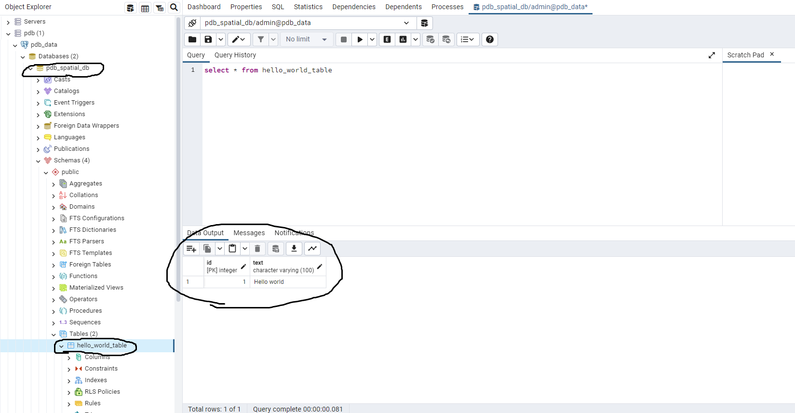

* NOTE: Start the docker container first: [ docker-compose up ] from the command line from the root folder of this project.

# 1. How to create PostgreSQL using the pgAdmin GUI?

# 1.1. Connect to the database

1. Access http://localhost:5050
   
2. Log in with the credentials from the docker-compose file: 
    * username: admin@admin.com 
    * password: root
    
# 1.2. Create table in pdb_spatial_db

1. In the left menu, right click on the Servers (or create your own group) > Register > Server...
    * Tab General > Name : e.g. pdb_data
    * Tab Connection > Host name/address: postgres_postgis-db (name of the docker service)
    * Tab Connection > Port : 5432
    * Tab Connection > Maintenance database : pdb_spatial_db
    * Tab Connection > Username : admin
    * tab Connection > Password : admin
    * tab Parameters > SSL mode > value : disabled
    * Click SAVE. If the settings are correct, the database connection should be created, otherwise an error will be thrown.
    
2. Create the hello_world_table and insert dummy data into it, so the python script will be able to connect to the postgresql and retrieve the data.
    * From the left menu, click on the Databases > pdb_spatial_db (right click) > Query Tool
    
3. In the Query Tool run these scripts:

* Note: each script can be run with F5, or the [ > icon in the GUI ]
    * The selected statement will be run after pressing the F5
    
* [ create table hello_world_table (id SERIAL PRIMARY KEY, text varchar(100)); ]
* [ insert into hello_world_table (text) values('Hello world') ]
* Make sure that the data are correctly retrieved by running : [ select * from hello_world_table]

